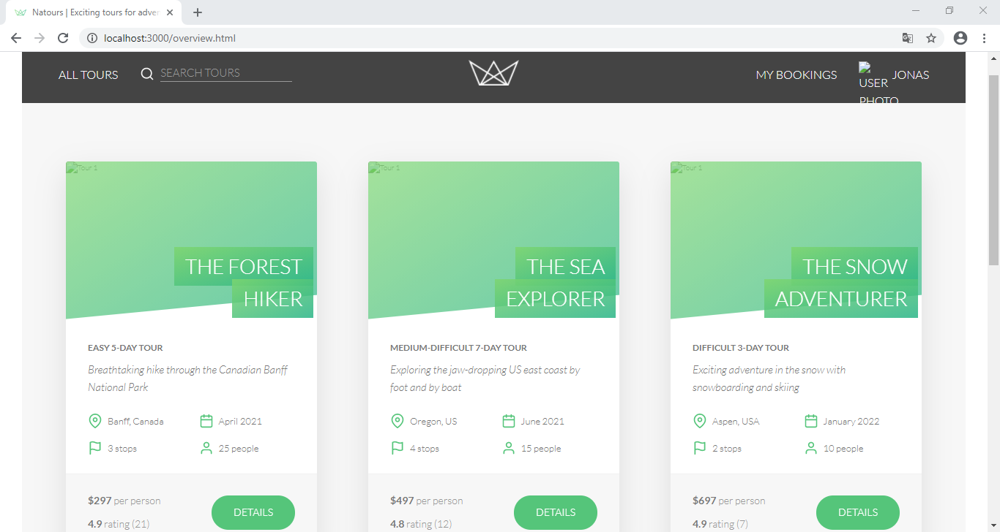

# Natours [WORK IN PROGRESS]

_Exciting tours for adventurous people_

## Features [currently implemented]

-   Some Restful API endpoints (more details below)
-   Communication with remote database
-   Routing to static files

## API

-   CRUD operations
-   Filter/Sorting/Pagination/Projection features implemented on certain endpoints
-   Aggregation pipeline applied to get data insights from database on certain endpoints
-   Download [this](api-docs/Natours.postman_collection.json) Postman collection to see details about the API endpoints (you'll need to install [Postman](https://www.postman.com/))

## How to run

-   Open your terminal on root folder and type `npm start`
-   Visit the address `localhost:3000/overview.html` on your browser (no front-end logic implemented yet)
-   In order to use the API, you'll need to add a `config.env` file containing credentials to your remote database (the server was not deployed yet)
-   Then run the `importData` npm script to store some initial data on your database

## Tools used

-   [Node.js](https://nodejs.org/)
-   [Express](http://expressjs.com/)
-   [MongoDB](https://www.mongodb.com/)
-   [Mongoose](https://mongoosejs.com/)
-   [Dotenv](https://github.com/motdotla/dotenv)
-   [Morgan](https://github.com/expressjs/morgan)
-   [Slugify](https://github.com/simov/slugify)

## Note

HTML templates provided by [Jonas Schmedtmann](https://twitter.com/jonasschmedtman)

## License

Read about license rights and limitations [here](LICENSE).
